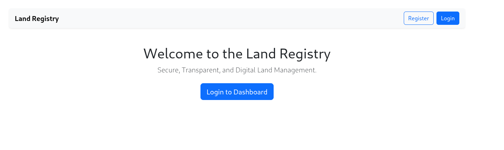
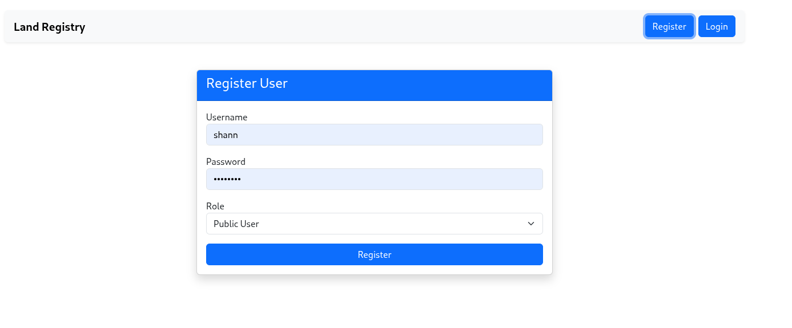
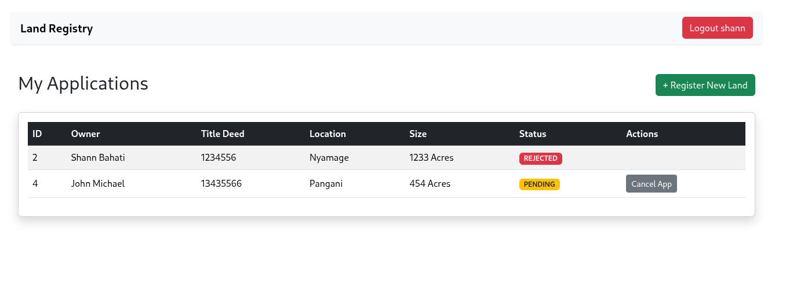
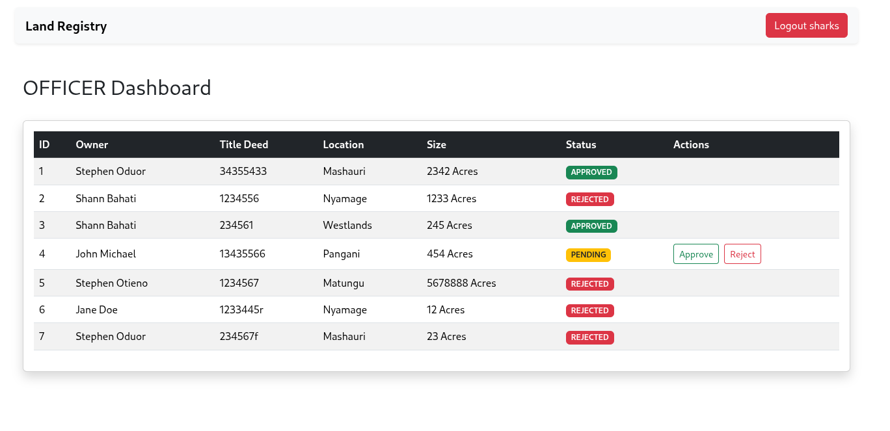
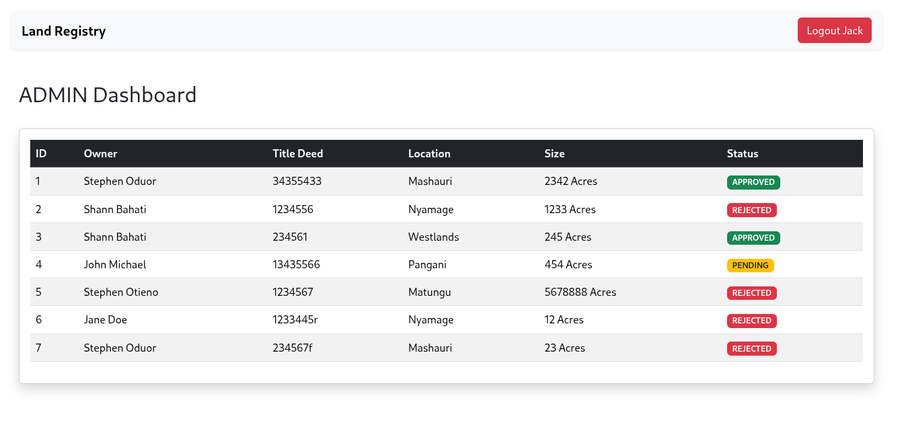

# Land Registration Digital System - Frontend Client

## 🖥️ Overview
The **Land Registration Digital System Frontend** is a modern, responsive user interface built with **React.js**. It provides a user-friendly dashboard for Land Registrars, Surveyors, and Public users to interact with the digital land registry.

It consumes the RESTful API provided by the Spring Boot backend to perform operations like searching for title deeds, registering new parcels, and managing ownership details.

## 🚀 Tech Stack
* **Framework:** React.js (Create React App / Vite)
* **HTTP Client:** Axios
* **Routing:** React Router DOM
* **Styling:** CSS3 / Bootstrap 5 / Tailwind (Adjust based on your preference)
* **State Management:** React Hooks (useState, useEffect)

## ✨ Key Features
* **Dashboard:** At-a-glance view of total registered lands and recent activities.
* **Land Registry:** View, sort, and filter a list of all land parcels (via `LandList.js`).
* **Digital Search:** Search for land by Title Number (e.g., `KISII/BLOCK/450`).
* **Registration Form:** Digital forms for capturing new land and owner details.
* **Responsive Design:** Optimized for desktop and tablets.

---

## 🛠️ Getting Started

### Prerequisites
Ensure you have the following installed:
* [Node.js](https://nodejs.org/) (v16 or higher)
* [npm](https://www.npmjs.com/) (usually comes with Node.js)

### 1. Clone the Repository
```bash
git clone [https://github.com/YourUsername/landregistry-frontend.git](https://github.com/YourUsername/land-registry-frontend.git)
cd landregistry-frontend
```

### 2. Install Dependencies
Install the required node modules defined in package.json:

```
npm install

```

### 3. Configure Backend Connection
Create a .env file in the root directory to store your backend URL. This ensures you don't hardcode URLs in your components.

File: .env

Properties
```
REACT_APP_API_URL=http://localhost:8080/api
```

### 4. Run the Application
   Start the local development server:
``` 
npm start
```
The application will open in your browser at http://localhost:3000.

### 📂 Project Structure
```
src/
├── components/          # Reusable UI components
│   ├── LandList.js      # Displays table of registered lands
│   ├── Navbar.js        # Top navigation bar
│   └── Footer.js        # Page footer
├── pages/               # Main page views
│   ├── Dashboard.js     # Home/Summary page
│   ├── RegisterLand.js  # Form to add new land
│   └── SearchLand.js    # Search interface
├── services/            # API service calls
│   └── LandService.js   # Axios configurations
├── App.js               # Main entry point & Routing
└── index.js             # DOM rendering

```


Here is a professional README.md file tailored for your Frontend React Application.

I have designed it to match the style of the backend README, ensuring your project documentation looks consistent and complete.

README.md
Markdown

# Land Registry System - Frontend Client

## 🖥️ Overview
The **Land Registry System Frontend** is a modern, responsive user interface built with **React.js**. It provides a user-friendly dashboard for Land Registrars, Surveyors, and Public users to interact with the digital land registry.

It consumes the RESTful API provided by the Spring Boot backend to perform operations like searching for title deeds, registering new parcels, and managing ownership details.

## 🚀 Tech Stack
* **Framework:** React.js (Create React App / Vite)
* **HTTP Client:** Axios
* **Routing:** React Router DOM
* **Styling:** CSS3 / Bootstrap 5 / Tailwind (Adjust based on your preference)
* **State Management:** React Hooks (useState, useEffect)

## ✨ Key Features
* **Dashboard:** At-a-glance view of total registered lands and recent activities.
* **Land Registry:** View, sort, and filter a list of all land parcels (via `LandList.js`).
* **Digital Search:** Search for land by Title Number (e.g., `KISII/BLOCK/450`).
* **Registration Form:** Digital forms for capturing new land and owner details.
* **Responsive Design:** Optimized for desktop and tablets.

---

## 🛠️ Getting Started

### Prerequisites
Ensure you have the following installed:
* [Node.js](https://nodejs.org/) (v16 or higher)
* [npm](https://www.npmjs.com/) (usually comes with Node.js)

### 1. Clone the Repository
```
git clone [https://github.com/YourUsername/land-registry-frontend.git](https://github.com/YourUsername/land-registry-frontend.git)
cd land-registry-frontend
```
### 2. Install Dependencies
Install the required node modules defined in package.json:

```
npm install
```
3. Configure Backend Connection
Create a .env file in the root directory to store your backend URL. This ensures you don't hardcode URLs in your components.

File: .env

Properties
``` 
REACT_APP_API_URL=http://localhost:8080/api

```

4. Run the Application
Start the local development server:

```

npm start
```

The application will open in your browser at http://localhost:3000.

📂 Project Structure
``` 

src/
├── components/          # Reusable UI components
│   ├── LandList.js      # Displays table of registered lands
│   ├── Navbar.js        # Top navigation bar
│   └── Footer.js        # Page footer
├── pages/               # Main page views
│   ├── Dashboard.js     # Home/Summary page
│   ├── RegisterLand.js  # Form to add new land
│   └── SearchLand.js    # Search interface
├── services/            # API service calls
│   └── LandService.js   # Axios configurations
├── App.js               # Main entry point & Routing
└── index.js             # DOM rendering

```
### 🔌 Connecting to Backend
If you encounter CORS errors when connecting to the Spring Boot backend (running on port 8080) from React (running on port 3000), ensure your Spring Boot Controller allows cross-origin requests:

Java
``` 
// In your Spring Boot Controller
@CrossOrigin(origins = "http://localhost:3000")
@RestController
@RequestMapping("/api/lands")
public class LandController { ... }

```

### 📸 Screenshots
Landing page



Signup page


User Dashboard


Officer Dashboard


Admin Dashboard
